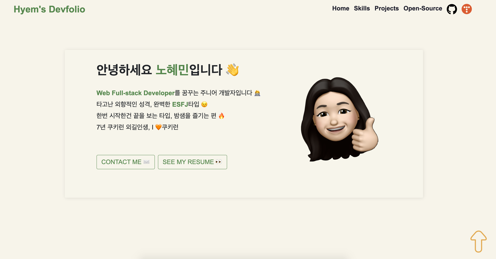

# hyem-devfolio

👉 [Hyemin's Developer Portfolio](https://hyeminnoh.github.io/Hyem-Devfolio/) Click!  

<kbd>
  
</kbd>

## Skill Set

| Category | Backend | Frontend |  
|:---:|:---:|:---:|  
| Language |  | Javascript |  
| Framework | Node.js & Express | Vue.js |  
| IDE | VSCode |  |

## 구현 내용

* [Fullpage.js](https://github.com/alvarotrigo/fullpage.js) 오픈소스를 활용한 fullpage 구성
* Bootstrap의 Layout, Grid, Navbar 활용
* Font-Awesome Icon 모듈 활용
* Github GraphQL API를 활용해 Pinned Repository 정보 조회

## 보완할 부분

* Container와 Component 분리
